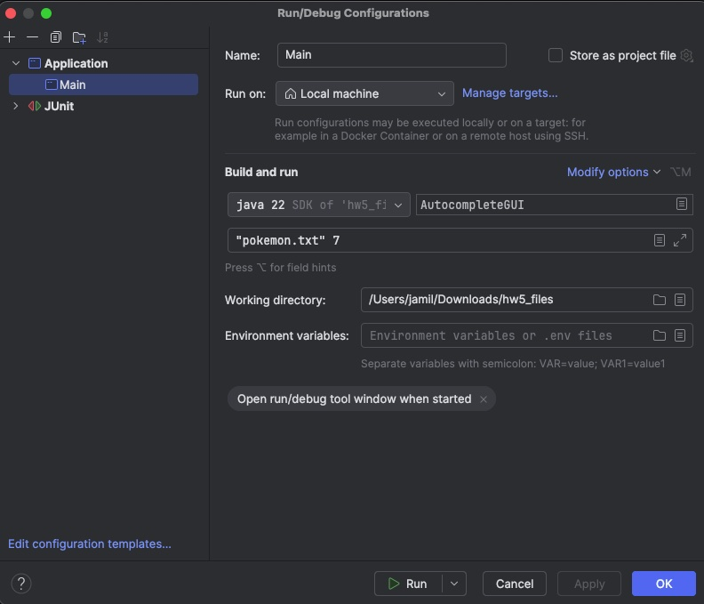
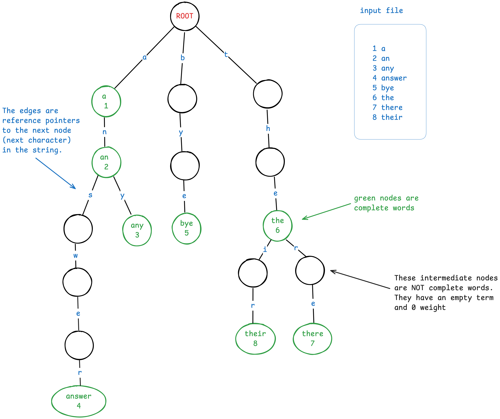

# Autocomplete with Trie

## Overview

This is an implementation of an Autocomplete UI that uses a Trie data structure to search with prefixes.

It was done from [this assignment](https://www.seas.upenn.edu/~cit5940/current/assignments/hw05/).

## Running

The `main` program expects two parameters: a path to a file and an integer for the maximum number of results.

### IntelliJ

In an IDE like IntelliJ, you can create a `Run Configuration` to do this.

1. From the main menu: Run > Edit Configurations
2. Click the `+` plus sign
3. Select `Application`
4. Give it a name like "Main"
5. Under the _Build and run_ options, select your Java version
6. For the class, use `AutocompleteGUI`
7. For the arguments, put a file path, followed by a space, followed by a number. You may need to quote the file path if it has spaces.

## Tests

Tests are split up into three files: `AutocompleteTest.java`, `TermTest.java` and `NodeTest.java`.

In `AutocompleteTest.java` I use a small set of words to test generating suggestions.

Below you'll find the resulting Trie structure from this.

I used the free web app [Excalidraw](https://excalidraw.com/) to make this trie diagram.